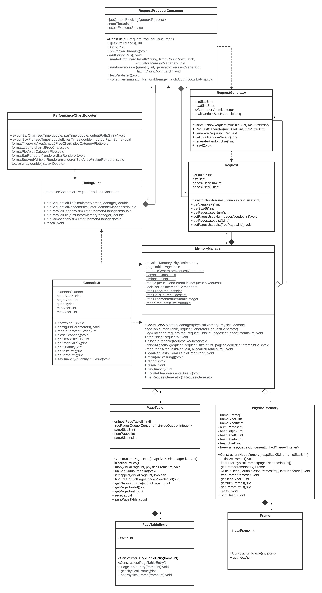

## 💾 About

**MMS** is a software simulates dynamic memory management using the page-based scheme (paging) with FIFO page replacement. It operates in concurrent/parallel mode based on the Producer–Consumer problem. Developed as a project for the Operating Systems course, it aims to explore memory management concepts and to simulate various workloads in order to analyze their impact on performance (execution time and memory usage).

<div align="center">

### Class Diagram

</div>

  

## 🏗️ Project Structure

```bash
MMS/
├── memory/
│   ├── manager/
│   │   └── MemoryManager.java
│   ├── virtual/
│   │   ├── PageTableEntry.java
│   │   └── PageTable.java
│   └── physical/
│       ├── Frame.java
│       └── PhysicalMemory.java
├── process/
│   ├── Request.java
│   ├── RequestGenerator.java
│   └── RequestProducerConsumer.java
└── PerformanceChartGenerator.java
```

## ⚙️ Technologies

- [Java](https://docs.oracle.com/en/java/)
- [Maven](https://maven.apache.org)
- [JFreeChart](https://www.jfree.org/jfreechart/)

## 📄 Dependencies

- [`Java JDK`](https://www.oracle.com/java/technologies/downloads/) (requires Java 8 or higher)

## 🚀 How to Run

```bash
#Clone the project
$ git clone https://github.com/Ytalk/main-memory-simulator.git
```

```bash
#Enter directory
$ cd main-memory-simulator
```

```bash
#Run

#Linux/macOS:
$ chmod +x mvnw
$ ./mvnw compile
$ ./mvnw exec:java

#Windows:
$ ./mvnw compile
$ ./mvnw exec:java
```